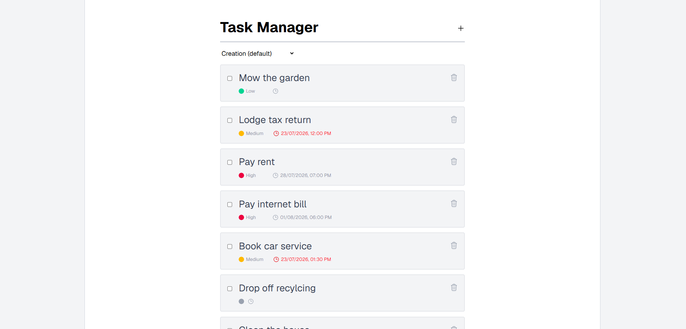
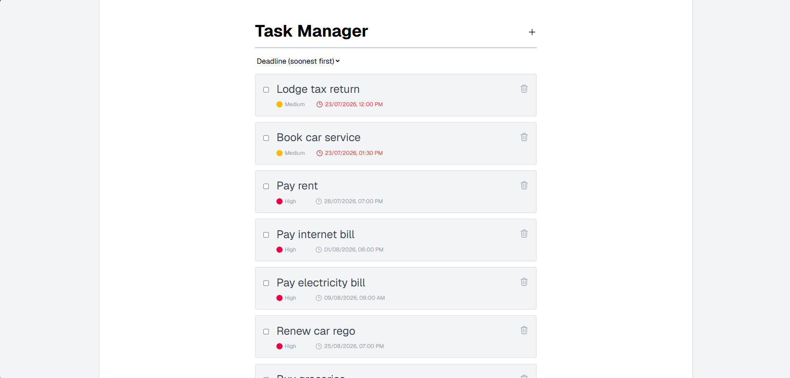
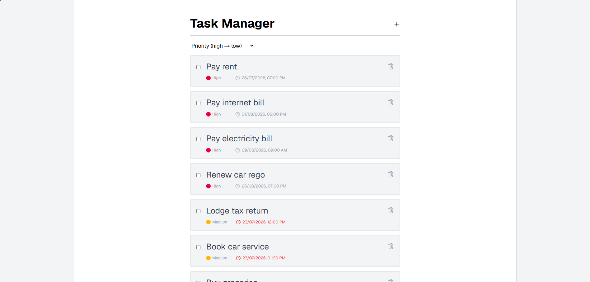
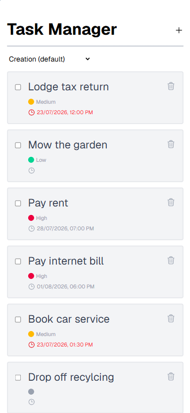
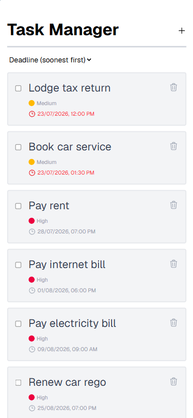
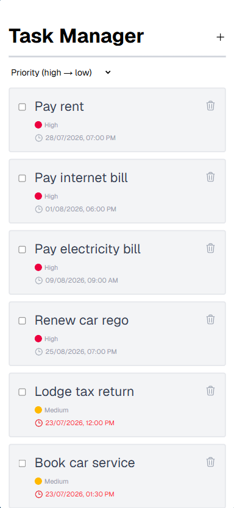

# Next.js Task Manager
A lightweight task manager built with Next.js, TypeScript, Tailwind CSS, and MongoDB. It includes full CRUD operations for tasks, priority levels, and task deadlines via React DatePicker, powered by RESTful API routes. This project starts with an empty database, but an optional seed script is included to populate 15 demo tasks for quick testing.

## Demo
### Screenshots (Desktop)
<div style="display: flex; flex-wrap: wrap; gap: 16px;">
  
  
  
</div>

### Video (Desktop)
<div style="display: flex;">
  
</div>

### Screenshots (Mobile)
<div style="display: flex; flex-wrap: wrap; gap: 16px;">
  
  
  
</div>

### Video (Mobile)
<div style="display: flex;">
  
</div>

## Features
- **Task Management** — Create, update, and delete tasks.
- **Completion Status** — Mark tasks complete or reactivate them using a checkbox.
- **Priority Levels** — Add, update, or remove task priority values.
- **Deadlines** — Add, update, or remove task deadlines using React DatePicker.
- **Overdue Detection** — Automatically flag overdue tasks.
- **Sorting Options** — Sort tasks by creation date, priority level, or deadline.
- **Responsive Layout** — Fully responsive across desktop and mobile using Tailwind CSS.

## How It Works
- **Client-side Interactions** — Creating, updating, deleting, sorting, and completing tasks are handled through React components.
- **RESTful API Routes** — All CRUD task operations are processed via Next.js API routes.
- **MongoDB Storage** — Stores all task data, including titles, priorities, deadlines, completion status, and timestamps for creation and completion.
- **React DatePicker** — Provides date and time selection for task deadlines.
- **Overdue Detection** — Calculated client‑side by comparing each deadline against the current date to highlight overdue tasks.
- **Sorting Logic** — Organises tasks by creation timestamp, deadline timestamp, or priority level (high → low).

## Tech Stack
- Next.js
- TypeScript
- Tailwind CSS
- MongoDB

## Installation
1. **Clone the Repository** — Clone the project to your local machine.
2. **Install Dependencies** — Run ```npm install``` to install all required packages.
3. **Create Environment File** — Create a ```.env``` file in the project root.
4. **Add MongoDB connection** — Add your MongoDB details to ```.env```
    - ```MONGODB_URI="mongodb://localhost:27017"```
    - ```MONGODB_DB="taskmanager"```
5. **Start Development Server** — Run ```npm run dev``` to start the Next.js development server.
6. **Open the App** — Visit http://localhost:3000 in your browser.
7. **Import Seed Data (Optional)** — Run ```npm run seed``` to import default data for testing.

## Usage
- **View Task List** — View all tasks in a single scrollable list.
- **Create Task** — Add new tasks using the + icon on the right side of the header.
- **Set Priority** — Optionally, select a priority level (Low, Medium, High) when creating or editing a task.
- **Add Deadlines** — Optionally select a date and time using the clock icon powered by React DatePicker.
- **Complete Tasks** — Mark tasks complete using the checkbox, or uncheck to reactivate.
- **Edit Tasks** — Update task titles, priorities, or deadlines.
- **Delete Tasks** — Remove tasks permanently using the trash icon.
- **Sort Tasks** — Sort by creation date, priority level, or deadline using the sort-by dropdown.
- **View Overdue Tasks** — Overdue tasks are automatically highlighted based on their deadline.

## Future Improvements
- **Multiple Task Lists** — Organise tasks into separate categories or projects.
- **Recurring Tasks** — Support daily, weekly, or monthly repeating tasks.
- **Task Tagging** — Add tags for additional categorisation and filtering.
- **Dark Theme** — Include a theme toggle stored in local preferences.
